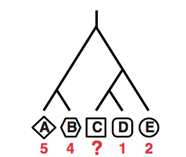

```{r setup, include=FALSE}
knitr::opts_chunk$set(echo = FALSE)
library(DiagrammeR)
```

## About DiagrammeR

- Version `r packageVersion("DiagrammeR")`
- Graph and network visualisation in R
- Built-in layout engines:
    - **Graphviz (DOT)**
    - **mermaid**
- Methods for graph creation and manipulation

## Simple graph creation with Graphviz
Can I recreate these diagrams from recent presentations?

<div class="center">


</div>

## Recreating the lifecycle diagram

```{r lifecycle-1}
grViz("dot-lifecycle.gv")
```

## Recreating the phylogenetic tree
```{r phylotree-1}
grViz("dot-phylotree.gv")
```

## Documentation

http://rich-iannone.github.io/DiagrammeR/
