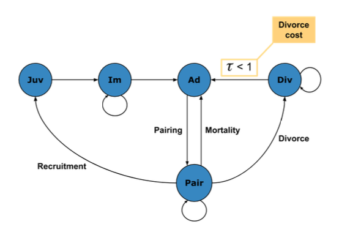
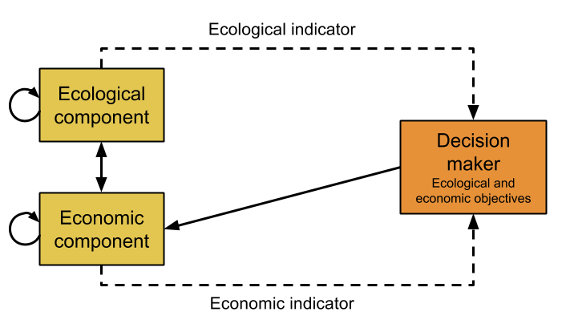

<style>
pre {
  font-size: 18px;
  line-height: 25px;
}
</style>

```{r setup, include=FALSE}
knitr::opts_chunk$set(echo = FALSE)
library(DiagrammeR)
```

## About DiagrammeR

- Created by Rich Iannone
- Version `r packageVersion("DiagrammeR")`
- Graph and network visualisation in R
- Built-in layout engines:
    - **Graphviz (DOT)**
    - **mermaid**
- Graph creation and manipulation in R

## Using DiagrammeR with Graphviz
```{r, echo = TRUE}
grViz("digraph {
node [shape = circle, width = 0.4];
A->B
A->D
B->C
D->E
graph [rankdir = LR]
}", height = 200)
```

## Simple graph creation with Graphviz
Can I recreate these diagrams from recent presentations?

<div class="center">


</div>

## Recreating the lifecycle diagram

```{r lifecycle-1}
grViz("dot-lifecycle.gv")
```

## Creating data-driven diagrams

- Node data frame `create_node_df()`
    - Node type/label
    - Attributes for rendering e.g. colour, shape
    - Other columns for associated data
- Edge data frame `create_edge_df()`
    - From/to node IDs
    - Relationship
    - Attributes for rendering e.g. colour, line width
- Node and edge data frames can be combined: `combine_ndfs()`, `combine_edfs()`

## Documentation

http://rich-iannone.github.io/DiagrammeR/

> Warning: online documentation for graph creation/manipulation functions corresponds to a previous release!
